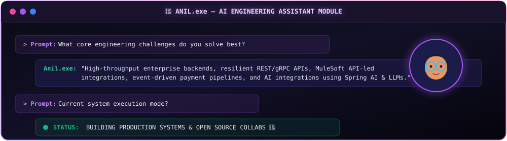
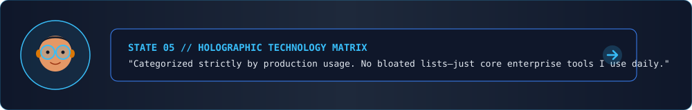
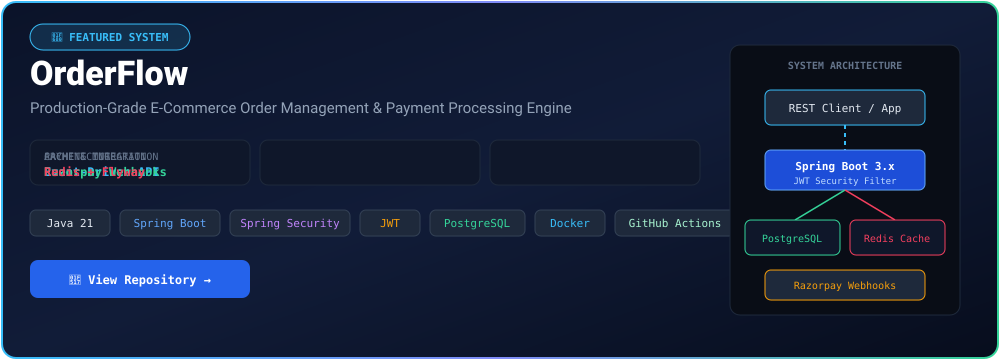
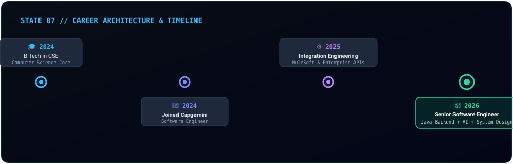
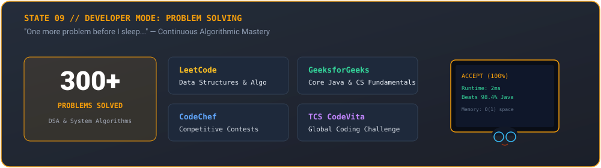
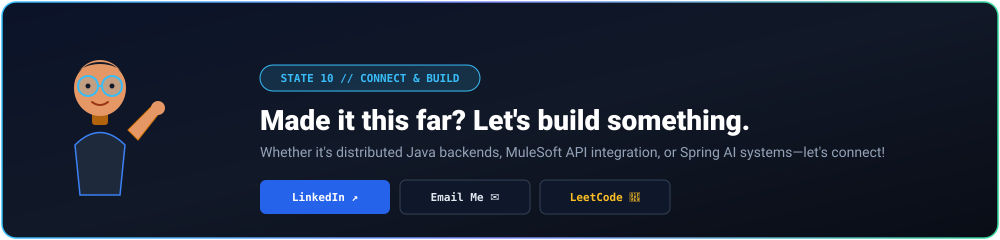

<!--
==============================================================================
🚀 ANIL RANA - DEVELOPER COMMAND CENTER README
GitHub: https://github.com/anilkrrana
Role: Senior Software Engineer | Java Backend | MuleSoft | AI
==============================================================================
-->

  <!-- TOP COMPACT NAVIGATION BAR -->
  

    <a href="#about-me"><b>[ ABOUT ]</b></a> &nbsp;•&nbsp;
    <a href="#tech-matrix"><b>[ TECH STACK ]</b></a> &nbsp;•&nbsp;
    <a href="#featured-projects"><b>[ PROJECTS ]</b></a> &nbsp;•&nbsp;
    <a href="#engineering-journey"><b>[ JOURNEY ]</b></a> &nbsp;•&nbsp;
    <a href="#problem-solving"><b>[ PROBLEM SOLVING ]</b></a> &nbsp;•&nbsp;
    <a href="#github-stats"><b>[ STATS ]</b></a> &nbsp;•&nbsp;
    <a href="#connect"><b>[ CONNECT ]</b></a>
  

  <!-- HERO SECTION SVG BANNER -->
  

 

<!-- TERMINAL COMMAND CENTER -->

  

 

<!-- ANIL.EXE AI ASSISTANT MODULE -->

  

 

## 👨‍💻 ABOUT ME — STATE 03: THE BACKEND ENGINE

<table>
  <tr>
    <td width="65%" valign="top">
      <h3>👋 Hey, I'm Anil Rana</h3>
      
<b>Senior Software Engineer at Capgemini</b> specializing in building production-grade enterprise backend systems, resilient REST APIs, event-driven architectures, and MuleSoft integration pipelines.

      <ul>
        <li>🚀 <b>Core Focus:</b> Java 21, Spring Boot 3.x, MuleSoft API-led connectivity, Redis caching, &amp; System Design.</li>
        <li>🤖 <b>AI Integration:</b> Integrating LLM APIs and intelligent agent workflows using <b>Spring AI</b> into legacy and modern backend architectures.</li>
        <li>⚡ <b>Engineering Philosophy:</b> High performance, zero unnecessary complexity, clean architecture, and continuous algorithmic problem solving.</li>
      </ul>
    </td>
    <td width="35%" align="center" valign="middle">
        
        
      
    </td>
  </tr>
</table>

 

## ⚡ STATE 05 — HOLOGRAPHIC TECHNOLOGY MATRIX

  

 

<table width="100%">
  <tr>
    <td width="50%" valign="top">
      <h4>☕ BACKEND ENGINEERING</h4>
      

        
        
        
        
        
        
      

    </td>
    <td width="50%" valign="top">
      <h4>⚙️ INTEGRATION &amp; MIDDLEWARE</h4>
      

        
        
        
        
        
      

    </td>
  </tr>
  <tr>
    <td width="50%" valign="top">
      <h4>🗄️ DATABASE &amp; CACHING</h4>
      

        
        
        
        
        
      

    </td>
    <td width="50%" valign="top">
      <h4>🛠️ DEVOPS, AI &amp; TOOLS</h4>
      

        
        
        
        
        
        
      

    </td>
  </tr>
</table>

 

## 🧩 STATE 04 &amp; 06 — FEATURED ENGINEERING PROJECTS

  

 

### 🚀 [OrderFlow](https://github.com/anilkrrana/orderflow) — Production Order & Payment Platform
* **Engineering Problem:** Scalable, transactional order processing engine handling concurrent payments, inventory state transitions, and automated database migrations.
* **Core Technology:** `Java 21` • `Spring Boot 3` • `Spring Security + JWT` • `PostgreSQL` • `Redis Caching` • `Razorpay Webhooks` • `Flyway DB` • `Docker` • `GitHub Actions CI/CD`
* **Key Features:**
  * JWT-secured stateless authentication with role-based access control.
  * Razorpay payment gateway integration with idempotent webhook processing.
  * Low-latency order status query caching powered by Redis.
  * Automated database versioning and seamless containerization via Docker.

 

## 📈 STATE 07 — ENGINEERING JOURNEY

  

 

## 🧩 STATE 09 — DEVELOPER MODE: PROBLEM SOLVING

  

 

## 📊 STATE 08 — GITHUB ACTIVITY MONITOR

  <table width="100%">
    <tr>
      <td width="50%" align="center">
        
      </td>
      <td width="50%" align="center">
        
      </td>
    </tr>
    <tr>
      <td colspan="2" align="center">
        
      </td>
    </tr>
  </table>

 

## 🌎 STATE 10 — CONNECT &amp; COLLABORATE

  

 

  
  &nbsp;
  
  &nbsp;
  
  &nbsp;
  
  &nbsp;
  

 

  

    <i>Designed with precision for Anil Rana's GitHub Command Center • Powered by Modern SVG Animation &amp; Clean Architecture</i>
  

