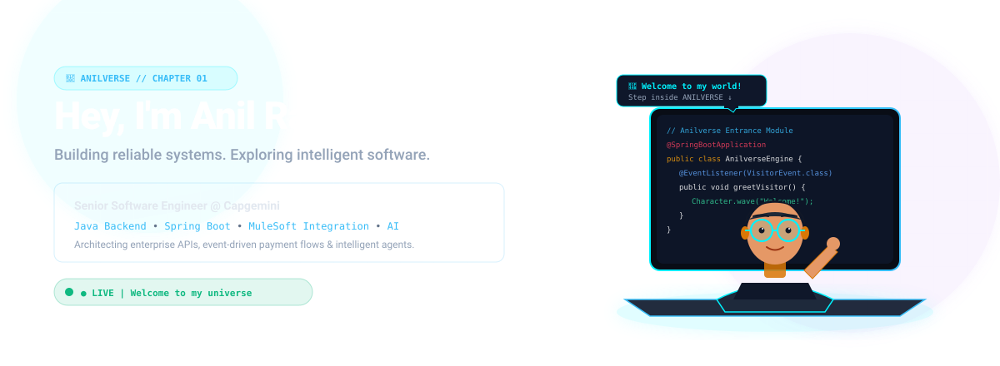
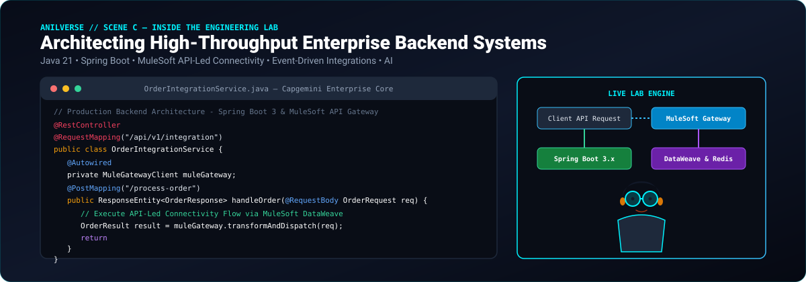
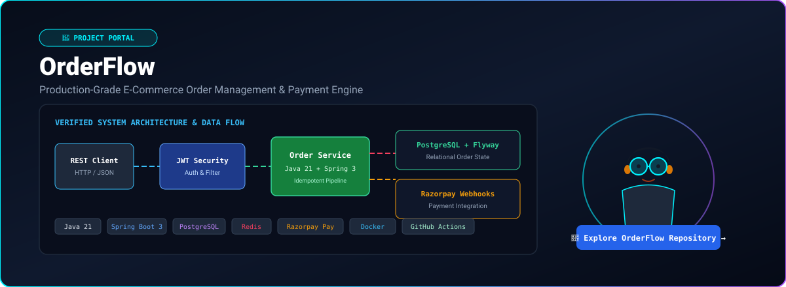
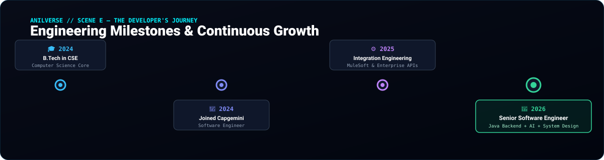
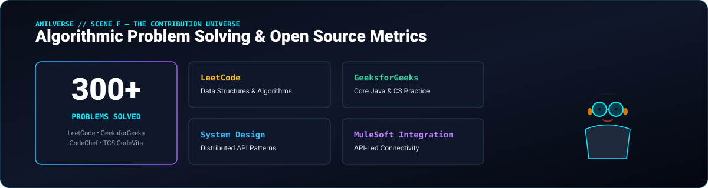
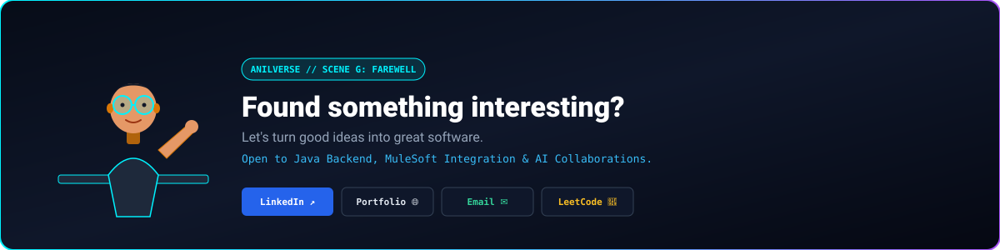

<!--
==============================================================================
🌌 ANILVERSE — A PERSONAL DEVELOPER UNIVERSE BY ANIL RANA
GitHub Username: anilkrrana
Role: Senior Software Engineer @ Capgemini
==============================================================================
-->

  <!-- TOP EDITORIAL NAVIGATION -->
  

    <a href="#entrance"><b>[ ENTRANCE ]</b></a> &nbsp;•&nbsp;
    <a href="#engineering-lab"><b>[ ENGINEERING LAB ]</b></a> &nbsp;•&nbsp;
    <a href="#project-portal"><b>[ ORDERFLOW ]</b></a> &nbsp;•&nbsp;
    <a href="#journey"><b>[ JOURNEY ]</b></a> &nbsp;•&nbsp;
    <a href="#contributions"><b>[ CONTRIBUTIONS ]</b></a> &nbsp;•&nbsp;
    <a href="#connect"><b>[ CONNECT ]</b></a>
  

  <!-- SCENE A — THE ENTRANCE -->
  
  

 

<!-- SCENE B — ENTER MY WORLD -->

  

 

<!-- SCENE C — INSIDE THE ENGINEERING LAB -->

  

 

<table width="100%">
  <tr>
    <td width="50%" valign="top">
      <h4>☕ BACKEND ENGINEERING CORE</h4>
      <ul>
        <li><b>Java 21 &amp; Spring Boot 3.x:</b> High-throughput microservices, Spring Security JWT authentication, and idempotent REST APIs.</li>
        <li><b>AI &amp; Smart Workflows:</b> Spring AI integration, LLM agent workflows, and intelligent automated backend pipelines.</li>
      </ul>
    </td>
    <td width="50%" valign="top">
      <h4>⚙️ INTEGRATION &amp; MIDDLEWARE</h4>
      <ul>
        <li><b>MuleSoft API-Led Connectivity:</b> Designing System, Process, and Experience APIs with Mule Gateway.</li>
        <li><b>DataWeave &amp; Messaging:</b> Complex enterprise data transformations, activeMQ event queues, and system interoperability.</li>
      </ul>
    </td>
  </tr>
</table>

 

<!-- SCENE D — THE PROJECT PORTAL: ORDERFLOW -->

  

 

### 🚀 [OrderFlow](https://github.com/anilkrrana/orderflow) — Production Order & Payment Platform
* **Engineering Objective:** Transactional, event-driven order management engine handling concurrent payment states and database migrations.
* **Verified Stack:** `Java 21` • `Spring Boot 3` • `Spring Security + JWT` • `PostgreSQL` • `Redis Caching` • `Razorpay Webhooks` • `Flyway DB` • `Docker` • `GitHub Actions CI/CD`
* **Architectural Highlights:**
  * Stateless JWT authentication with role-based authorization filters.
  * Razorpay payment gateway integration with idempotent webhook handlers.
  * Low-latency order status query caching powered by Redis.
  * Automated DB versioning via Flyway and containerization with Docker.

 

<!-- SCENE E — THE DEVELOPER'S JOURNEY -->

  

 

<!-- SCENE F — THE CONTRIBUTION UNIVERSE -->

  

 

  <table width="100%">
    <tr>
      <td width="50%" align="center">
        
      </td>
      <td width="50%" align="center">
        
      </td>
    </tr>
  </table>

 

<!-- SCENE G — THE FAREWELL & VERIFIED CONNECT LINKS -->

  

 

  <!-- VERIFIED USER SOCIAL BUTTONS -->
  
  &nbsp;
  
  &nbsp;
  
  &nbsp;
  
  &nbsp;
  
  &nbsp;
  
  &nbsp;
  

 

  

    🌌 <i>ANILVERSE Architecture v4.0 • Designed for Anil Rana (Senior Software Engineer @ Capgemini)</i>
  

